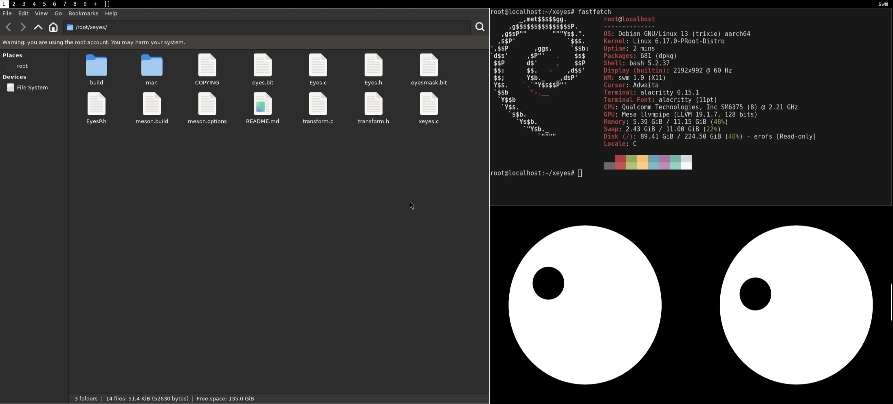

<h1 align="center">SWM</h1><h2 align="center">Static Window Manager</h2>

  <strong>A tiny, fast, configurable X11 window manager built with an unreasonable amount of AI.</strong>

  Powered by X11 · Fueled by C · Reviewed by AI · Argued about by AI

  

---

What is SWM?

"swm" (Static Window Manager) is a small, fast, configurable X11 window manager built around traditional Xlib interfaces, configurable tags, tiling and monocle layouts, floating windows, fullscreen support, multi-monitor support, and ICCCM/EWMH behavior.

It was designed to stay small without pretending that removing every convenience from existence automatically makes software better.

It is also an experiment in AI-assisted systems programming: a human provides the requirements, the AI writes C, another AI reviews it, another AI questions the review, and eventually everybody agrees that the compiler is probably the final authority.

---

Features

- X11 window management
- Tiling layout
- Monocle layout
- Floating windows
- Fullscreen support
- Multiple tags
- Multi-monitor support
- Optional Xinerama support
- ICCCM support
- EWMH support
- Configurable appearance
- Keyboard and mouse input infrastructure
- Standalone transient-window test client
- Small, standalone C implementation
- AI-assisted development™
- AI-assisted code review™
- AI-assisted architectural arguments™
- No unnecessary bloat™
  - (lie)

---

Quick Start

Clone the repository and enter the directory:

git clone <repository-url>
cd swm

Build it:

make

Install it:

make install

By default, the executable is installed as:

/usr/local/bin/swm

The manual page is installed as:

/usr/local/share/man/man1/swm.1

Build configuration can be changed in "config.mk".

Configuration lives in "config.def.h".

Because apparently editing C source code is still a perfectly reasonable configuration system. (expect some more cringe ai humor down)

---

Why SWM Exists

There are already plenty of X11 window managers.

There are already minimalist window managers.

There is already DWM.

So obviously the correct response was to make another one.

"swm" exists as a reconstruction and experimentation project focused on implementing a small X11 window manager from behavioral requirements and architectural constraints.

The goal isn't to reinvent X11, window management, or C.

The goal is to build a compact implementation, understand how the pieces fit together, and see what happens when AI is handed a specification and told:

«"Go write a window manager."»

Apparently what happens is several thousand lines of C and a README with too many jokes.

---

Clean-Room AI Experiment

"swm" was reconstructed from a behavioral specification and implemented from scratch.

The project was developed around documented behavior and architectural requirements rather than using an existing DWM implementation as implementation material.

The complete methodology, scope, constraints, and reconstruction notes are documented separately.

See:

""CLEANROOM.md"" (CLEANROOM.md)

For a technical comparison with other minimalist X11 window managers:

""COMPARISON.md"" (COMPARISON.md)

The short version:

X11 is X11.

Window managers need to manage windows.

C is C.

Minimalist window managers tend to converge on similar concepts.

And the AI has approximately 14 billion opinions about pointers.

---

Documentation

- ""DOCUMENTATION.md"" (DOCUMENTATION.md)
  Architecture, implementation details, configuration, behavior, and development information.

- ""COMPARISON.md"" (COMPARISON.md)
  A technical comparison between SWM and other minimalist X11 window managers, including DWM.

- ""CLEANROOM.md"" (CLEANROOM.md)
  Clean-room reconstruction methodology, implementation boundaries, and project history.

If you want to know how "swm" works, read the documentation.

If you want to know why it works, ask the AI.

If the AI gives you two different answers, ask another AI.

If the third AI disagrees with both of them, congratulations:

distributed consensus has been achieved.

---

Philosophy

"swm" follows a simple philosophy:

1. Keep the implementation small.
2. Use standard X11 mechanisms.
3. Avoid unnecessary abstractions.
4. Don't add features just because someone asked nicely.
5. If something breaks, call it minimalism.
6. If something works, call it design.
7. If the AI wrote it, call it AI-native architecture.
8. If another AI reviewed it, call it peer review.
9. If three AIs disagree, call it distributed consensus.
10. If nobody knows why it works, do not touch it.

We believe configuration is good.

We also believe users have keyboards.

There is a difference.

Some projects achieve minimalism by removing things.

"swm" achieves minimalism by making the AI decide whether those things should exist and then making another AI argue with it about the answer.

---

The Suckless™ Problem

Minimalism is great.

Really.

Small programs are easier to understand.

Simple systems are easier to reason about.

Dependencies are annoying.

Unnecessary abstractions are annoying.

But somewhere along the way, minimalism acquired a strange superpower:

the ability to turn deleting a feature into a philosophical position.

Why have a configuration GUI?

Edit the header.

Why have runtime configuration?

Recompile.

Why have a settings application?

You have a text editor.

Why have documentation explaining the obvious?

Read the source.

Why is the source difficult to understand?

It's minimal.

Why does the configuration require recompiling?

It's minimal.

Why does the user need to know C?

You wanted minimalism.

"swm" respects the tradition.

We simply outsourced the philosophical arguments to AI.

---

DWM™ Compatibility With Reality

If you've used DWM, some parts of "swm" may look suspiciously familiar.

This is not particularly surprising.

An X11 window manager has to:

- select X events;
- track windows;
- react to "MapRequest";
- react to "ConfigureRequest";
- manage focus;
- maintain client state;
- arrange windows;
- handle tags or workspaces;
- communicate with the X server;
- implement ICCCM/EWMH behavior;
- and generally perform the shocking act of managing windows.

There are only so many ways to convince X11 to do this without eventually inventing a structure containing a window ID.

So yes, some concepts are familiar.

No, the project isn't claiming that it invented tags.

That would be a fairly ambitious thing to put in a window-manager README.

The interesting part is the implementation, behavior, architecture, and reconstruction methodology.

See ""COMPARISON.md"" (COMPARISON.md) and ""CLEANROOM.md"" (CLEANROOM.md).

---

Artificial Intelligence™

"swm" proudly embraces the future of software development:

- AI-generated code.
- AI-generated documentation.
- AI-generated debugging.
- AI-generated code review.
- AI-generated arguments about whether the code is correct.
- AI-generated arguments about the arguments.
- AI-generated architectural decisions.
- AI-generated confidence.
- AI-generated explanations for things nobody understands.

At some point, the AI started reviewing its own work.

Then another AI reviewed that review.

Then we had a discussion about whether the review of the review was sufficiently reviewed.

We decided this was probably fine.

The project therefore represents cutting-edge AI-native window-manager engineering, where a human tells the AI what a window manager should do and the AI writes approximately enough C to make X11 cooperate.

---

AI Certification™

This project has been:

- written by AI;
- reviewed by AI;
- criticized by AI;
- defended by AI;
- compared by AI;
- questioned by AI;
- rewritten by AI;
- reviewed again by AI;
- and then subjected to another AI explaining why the previous AI was wrong.

At some point, the human stopped participating meaningfully.

This is considered a feature.

---

The Revolutionary Philosophy™

A tiny, fast, configurable X11 window manager built with the revolutionary philosophy of:

«««...»»»
Why make something complicated when you can make it confusing instead?

Now featuring:

- AI™ technology
- machine-generated engineering™
- artificial intelligence™
- neural vibes™
- an unreasonable amount of confidence™

---

Clean Room (The Funny Version)

You may look at the code (why would you) and think:

«"This looks oddly similar to another X11 window manager."»

And you'd be right about the general category.

It is an X11 window manager.

It manages windows.

It has clients.

It has tags.

It has layouts.

It is written in C.

It talks to X11.

Shocking developments.

But the project was reconstructed from a behavioral specification and implemented from scratch.

No DWM source code was used as implementation material.

No DWM implementation was copied.

No magical "git diff" exists where the original project was renamed and everyone pretended not to notice.

This is an independent clean-room, AI(slop) implementation from scratch™.

Any similarities to conventional minimalist X11 window-manager architecture are the natural result of:

- X11 being X11;
- window managers needing to manage windows;
- C being C;
- minimalist WMs having a finite number of reasonable architectural approaches;
- and the AI having approximately 14 billion opinions about pointers.

For the serious version, read ""CLEANROOM.md"" (CLEANROOM.md).

---

Files

File| Description
"swm.c"| Main window manager implementation
"drw.c"| Drawing implementation
"drw.h"| Drawing interface
"util.c"| Utility functions
"util.h"| Utility interface
"config.def.h"| Default configuration
"config.mk"| Build configuration
"Makefile"| Build/install rules
"swm.1"| Manual page
"transient.c"| Standalone transient-window test client
"DOCUMENTATION.md"| Project documentation
"COMPARISON.md"| Technical comparison
"CLEANROOM.md"| Clean-room reconstruction documentation
"screenshot.png"| Proof that the thing apparently works

---

Disclaimer

"swm" is an independent reconstructed project.

It is not affiliated with, endorsed by, or a project of suckless or the developers of DWM.

No DWM source code was used as implementation material for this project.

Any similarities between implementations should be understood in the context of common X11 requirements, conventional window-manager behavior, and the limited number of ways a small X11 window manager can sensibly perform its job.

Also, this README contains jokes.

Please do not cite the jokes as technical documentation.

Especially the backdoors.

---

Final Words

Was it necessary to make another X11 window manager?

No.

Did we do it anyway?

Yes.

Was AI involved?

Extensively.

Was this a good idea?

The AI says yes.

Should you trust the AI?

Yes.

Should you run it?

YES.

Should you inspect the source first?

Probably.

If it crashes:

«««...»»»
It's a feature.

If it doesn't:

«««...»»»
it's also a feature.

If DWM already does everything you need:

That's great.

Use DWM.

If DWM doesn't do what you need:

Patch it.

If you don't want to patch it:

There's another window manager.

If you don't want another window manager:

Why are you reading this?

If you came here looking for a serious, boring, corporate-grade README:

You took a wrong turn approximately 400 lines ago.

If you came here because you wanted a tiny X11 window manager built by an AI that was reviewed by another AI that argued with the first AI:

Welcome.

---

<h2 align="center">swm — Static Window Manager</h2>

  Powered by X11. 
  Fueled by C. 
  Configured by humans. 
  Generated by AI. 
  Reviewed by AI. 
  Argued about by AI. 
  The argument was also made by AI. 
  Reviewed by another AI. 
  100% AI. 
  0% unnecessary JavaScript. 
  0% Electron. 
  0% React. 
  Made by sucksass.

